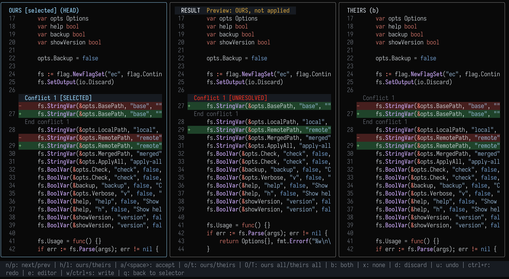
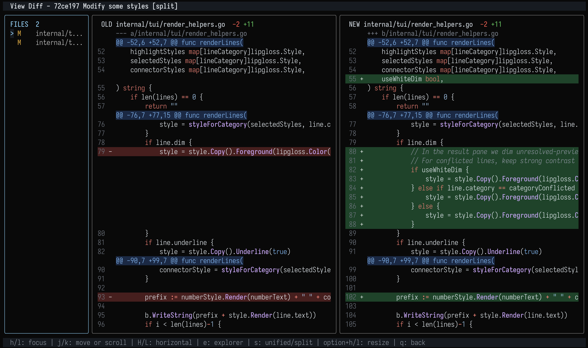

# ec (easy-conflict)

Terminal Git conflict resolver and diff viewer

[](https://codecov.io/gh/chojs23/ec)





ec (easy-conflict) helps you resolve Git merge conflicts and review changes
without leaving the terminal. 3-way conflict resolver with diff3 base
comparison, or browse working tree and commit changes in the diff viewer.

## Features

1. 3 pane TUI with ours, result, and theirs
2. Diff3 base view when available via git merge-file
3. Diff viewer with a file explorer and split or unified layouts
4. Non interactive modes for CI or scripts
5. Optional backup of the merged file

## Installation

### Homebrew

```
brew install ec
```

### Npm

```bash
npm install -g @chojs23/ec
```

Or run without installing:

```bash
npx @chojs23/ec
```

The npm package is a thin installer that downloads the matching prebuilt
binary from GitHub Releases at install time. Set `EC_SKIP_DOWNLOAD=1` to
skip the postinstall download in restricted environments.

### Nix

Install the packaged release from nixpkgs:

```bash
nix profile add nixpkgs#ec
```

Run the latest repo state without installing:

```bash
nix run github:chojs23/ec
```

Install the latest repo state into your profile:

```bash
nix profile add github:chojs23/ec
```

The nixpkgs package can lag behind the latest upstream release. Use the direct
repo commands above if you want the newest branch or tag immediately.

### Install script

You can run the installer through Make:

```
make install
```

- On Windows, this runs `scripts/install.ps1`.
- On Linux/macOS, this runs `scripts/install.sh`.

### Go install

```
go install github.com/chojs23/ec/cmd/ec@latest
```

### Via curl

```bash
curl -fsSL https://raw.githubusercontent.com/chojs23/ec/main/scripts/install.sh | sh
```

### Arch Linux (AUR)

build from source:

```
pikaur -S easy-conflict
```

binary:

```
pikaur -S easy-conflict-bin
```

### Windows

Download a Windows binary from GitHub Releases and add it to your `PATH`.

PowerShell installer (default: latest release, install to `$HOME\\.local\\bin`):

```powershell
irm https://raw.githubusercontent.com/chojs23/ec/main/scripts/install.ps1 | iex
```

Available release artifacts:

- `ec-windows-amd64.exe`
- `ec-windows-arm64.exe`

### Build from source

```
make build
```

## Quick start

Run with no args inside a Git repo

```
ec
```

The selector shows conflicted files first, followed by a `View Diff` section.
Choose `working tree` to inspect staged, unstaged, and untracked changes, or
choose one of the latest 100 commits. Each commit row shows its total deletions
in red and additions in green. The diff viewer lists changed files in the left
pane and shows the selected file patch in an old/new split layout by default.
Press `s` to toggle between split and unified diff layouts.

Diff viewer keys:

- `h` / `l`: focus the file explorer or diff view
- `j` / `k`: move or scroll in the focused pane
- `H` / `L`, `left` / `right`, or horizontal mouse wheel: scroll the focused pane horizontally
- `ctrl+u` / `ctrl+d`: scroll half a page
- `gg` / `G`: go to the top or bottom
- `e`: open or close the file explorer
- `s`: toggle unified or split diff
- `option+h` / `option+l` or `option+left` / `option+right`: resize the file explorer
- `q`: return to the selector

### Notes

ec does not run git add after you write

Git will still decide whether the merge is resolved based on the file contents

## Git mergetool configuration

You can set ec as your git mergetool by adding this to your git config

```
git config --global merge.tool ec
git config --global mergetool.ec.cmd 'ec "$BASE" "$LOCAL" "$REMOTE" "$MERGED"'
git config --global mergetool.ec.trustExitCode true
```

## Jujutsu merge-editor configuration

You can set ec as your jujutsu merge-editor by adding this to your jujutsu config

```
jj config set --user ui.merge-editor 'ec'
jj config set --user merge-tools.ec.merge-args '["$base", "$left", "$right", "$output"]'
```

## Usage

Interactive

```
ec <BASE> <LOCAL> <REMOTE> <MERGED>
ec --base <path> --local <path> --remote <path> --merged <path>
```

No args mode

```
ec
```

Non interactive

```
ec --check --merged <path>
ec --apply-all ours --base <path> --local <path> --remote <path> --merged <path>
```

## Neovim plugin (terminal buffer)

This repo includes a minimal Neovim plugin that opens ec in a terminal buffer.

Install with your plugin manager and ensure `ec` is on your PATH.

### Minimal config

```lua
require("ec").setup()
```

Using lazy.nvim

```lua
{
  "chojs23/ec",
  keys = {
    { "<leader>gr", ":Ec<CR>", desc = "Open ec" },
  },
}
```

<details>
<summary>Default config</summary>

```lua
{
  cmd = "ec",
  open_cmd = "tabnew",
  cwd = nil,
  float = true,
  close_on_exit = true,
}
```

Option notes:

- `cmd`: executable name or list with default args; `:Ec` args are appended.
- `open_cmd`: Vim command used when float is disabled or unavailable.
- `cwd`: working directory for ec; string path or function; defaults to `getcwd()`.
- `float`: enable floating window; table merges with float defaults.
- `close_on_exit`: close terminal on successful exit code 0.

Float defaults when `float = true`:

```lua
{
  width = 0.92,
  height = 0.86,
  border = "rounded",
  title = "ec",
  title_pos = "center",
  zindex = 50,
}
```

Float option notes:

- `width` and `height`: fractions of editor when <= 1, otherwise absolute size.
- `border`: floating window border style.
- `title`: title text for the float.
- `title_pos`: title alignment.
- `zindex`: float stacking order.

</details>

### Commands

```
:Ec
:Ec --base <path> --local <path> --remote <path> --merged <path>
```

## Resolver screen

The resolver shows three panes in one view.

The header shows the current conflict and how many remain unresolved. A fixed
state strip separates selection from the applied result, even when pane titles are narrow:

The center pane shows the result, with an explicit state for the current block:

Applied does not mean saved. Press `w` or `ctrl+s` to write the result.

Use `e` to open $EDITOR with the current result. When you exit the editor, the resolver reloads the merged file and keeps manual edits.

## Key bindings

Keybindings are vim-like by default.

### Navigation

- n / p: next and previous conflict
- gg / G: jump to top / bottom
- zz: recenter on selected hunk start
- j / k / up / down: vertical scroll
- ctrl+u / ctrl+d: half-page up / down
- H / L / left / right: horizontal scroll

### Selection and apply

- h / l: select ours or theirs
- a / space: accept selection
- o / t / b / x: apply ours, theirs, both, or none
- d: discard selection
- O / T: apply ours or theirs to all

### Other

- u: undo
- ctrl+r: redo
- e: open $EDITOR with current result
- w / ctrl+s: write file without quitting
- q: back to selector or quit

## Theme configuration

The TUI can load colors from a theme config file.

Config path:

```
$XDG_CONFIG_HOME/ec/themes.json (when XDG_CONFIG_HOME is set)
```

If `XDG_CONFIG_HOME` is not set, ec uses `os.UserConfigDir()/ec/themes.json`.
Typical defaults are `~/.config/ec/themes.json` on Linux,
`~/Library/Application Support/ec/themes.json` on macOS,
and `%AppData%\ec\themes.json` on Windows.

Example:

```
{
  "default": "warm",
  "themes": {
    "warm": {
      "header_bg": "94",
      "header_fg": "230",
      "added_bg": "58",
      "removed_bg": "88",
      "result_fg": "#f1f1f1",
      "selected_side_border": "#79c0ff"
    }
  }
}
```

Missing keys fall back to the built-in defaults.
The diff viewer uses `selected_side_border` for its focused pane so selection
matches the conflict resolver.
Both screens use `added_bg` and `removed_bg` behind syntax-colored code.
The resolver uses `selected_hunk_marker_fg` and `selected_hunk_marker_bg` for
the current block labels and `pane_border` for the result border.
Unresolved block labels use `selector_unresolved_fg`, sharing the selector's
red unresolved color. Pending preview text keeps `status_unresolved_fg`.

Legacy line-highlight, per-line conflict, dimming, result-border, and connector
keys remain accepted for old theme files, but no longer control resolver code
rows or its result border. Use the keys above for the current resolver layout.

Hex colors require a TrueColor-capable terminal to avoid 256-color downsampling.

Supported keys:
`title_fg`, `pane_border`, `selected_pane_border`, `side_pane_border`, `selected_side_border`,
`header_bg`, `header_fg`, `footer_bg`, `footer_fg`, `line_number`, `ours_highlight_bg`,
`ours_highlight_fg`, `theirs_highlight_bg`, `theirs_highlight_fg`, `result_fg`,
`result_highlight_bg`, `result_highlight_fg`, `modified_bg`, `modified_fg`, `added_bg`,
`added_fg`, `removed_bg`, `removed_fg`, `diff_hunk_bg`, `diff_hunk_fg`,
`conflicted_bg`, `conflicted_fg`,
`insert_marker_fg`, `selected_hunk_marker_fg`, `selected_hunk_marker_bg`, `selected_hunk_bg`,
`status_resolved_fg`, `status_unresolved_fg`, `result_resolved_marker_fg`,
`result_resolved_border`, `result_unresolved_border`, `toast_bg`, `toast_fg`,
`selector_resolved_fg`, `selector_unresolved_fg`, `dim_foreground_light`,
`file_status_modified_fg`, `file_status_untracked_fg`, `file_status_added_fg`,
`file_status_deleted_fg`, `file_status_renamed_fg`, `file_status_conflicted_fg`,
`dim_foreground_dark`, `dim_foreground_muted`.

<details>
<summary>Default theme colors</summary>

| Key                         | Default   |
| --------------------------- | --------- |
| `title_fg`                  | `#c9d1d9` |
| `pane_border`               | `245`     |
| `selected_pane_border`      | `117`     |
| `side_pane_border`          | `245`     |
| `selected_side_border`      | `117`     |
| `header_bg`                 | `#161b22` |
| `header_fg`                 | `#f0f6fc` |
| `footer_bg`                 | `#161b22` |
| `footer_fg`                 | `#8b949e` |
| `line_number`               | `#6e7681` |
| `ours_highlight_bg`         | `24`      |
| `ours_highlight_fg`         | `230`     |
| `theirs_highlight_bg`       | `52`      |
| `theirs_highlight_fg`       | `230`     |
| `result_fg`                 | `231`     |
| `result_highlight_bg`       | `60`      |
| `result_highlight_fg`       | `230`     |
| `modified_bg`               | `24`      |
| `modified_fg`               | `231`     |
| `added_bg`                  | `#0d4429` |
| `added_fg`                  | `#7ee787` |
| `removed_bg`                | `#4c1c1c` |
| `removed_fg`                | `#ff7b72` |
| `diff_hunk_bg`              | `#162a46` |
| `diff_hunk_fg`              | `#79c0ff` |
| `conflicted_bg`             | `131`     |
| `conflicted_fg`             | `231`     |
| `insert_marker_fg`          | `196`     |
| `selected_hunk_marker_fg`   | `117`     |
| `selected_hunk_marker_bg`   | `#161b22` |
| `selected_hunk_bg`          | `236`     |
| `status_resolved_fg`        | `42`      |
| `status_unresolved_fg`      | `#d29922` |
| `result_resolved_marker_fg` | `42`      |
| `result_resolved_border`    | `245`     |
| `result_unresolved_border`  | `245`     |
| `toast_bg`                  | `22`      |
| `toast_fg`                  | `230`     |
| `selector_resolved_fg`      | `42`      |
| `selector_unresolved_fg`    | `196`     |
| `file_status_modified_fg`   | `#d29922` |
| `file_status_untracked_fg`  | `#a371f7` |
| `file_status_added_fg`      | `#3fb950` |
| `file_status_deleted_fg`    | `#f85149` |
| `file_status_renamed_fg`    | `#58a6ff` |
| `file_status_conflicted_fg` | `#ff7b72` |
| `dim_foreground_light`      | `231`     |
| `dim_foreground_dark`       | `16`      |
| `dim_foreground_muted`      | `244`     |

</details>

## Backup behavior

Backups are off by default. Use --backup to write a sibling file named <merged>.ec.bak before writing the result.

## Base view behavior

Base chunks come from git merge-file --diff3 output. If the base stage is missing for a file, the tool continues without a base view and prints a warning.

## Contributing

New features and bug reports are welcome.

Feel free to open an issue or a pull request.

## License

MIT
